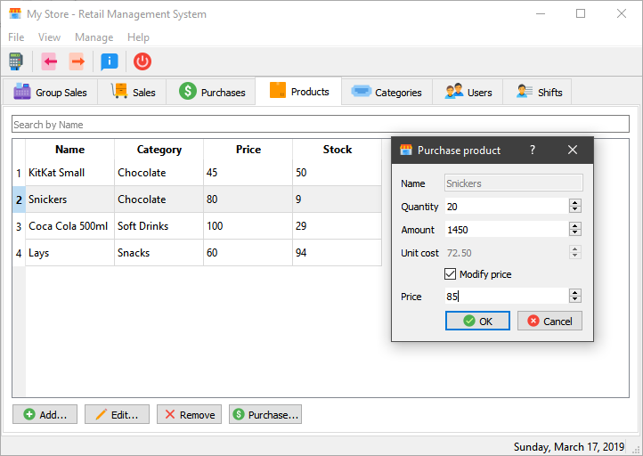
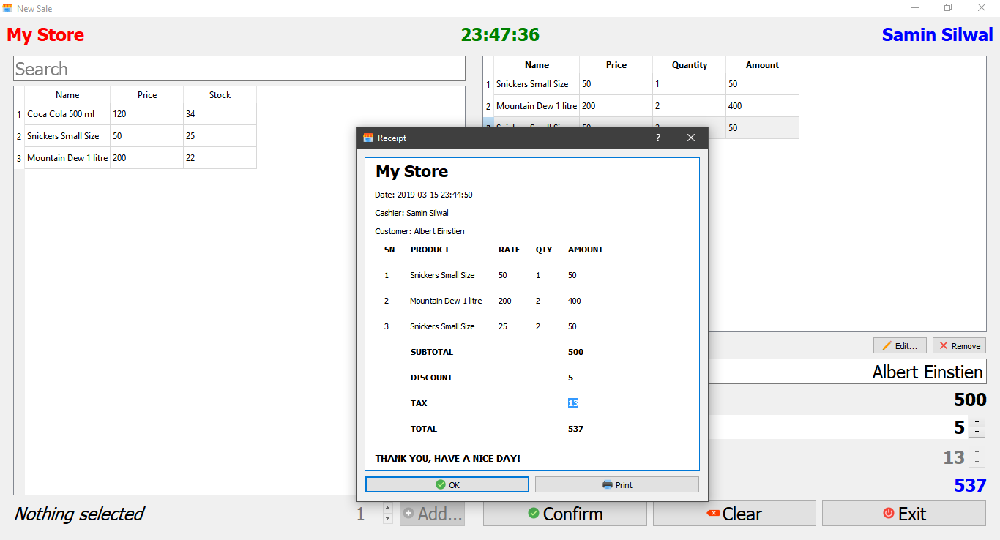

# Retail Management System

A simple application to manage a retail store developed in C++ using
the Qt framework.

## How to run

If you're using Windows, prebuilt binaries are available. Download the [latest release](https://github.com/smnslwl/Retail_Management_System/releases/latest) of **rms-X.Y.Z-win32.zip** and simply extract and run.

MacOS and Linux users will have to build from source for now. You'll
need to have the Qt framework installed in your machine. Clone this repo or download the source code and open the project in Qt Creator to build and run.

## Screenshots

